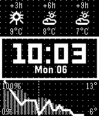

# Pebble Mesh

  

Pebble Mesh is an open-source, retro-digital watch face designed for maximum clarity and essential stats. This face features a signature dot-matrix grid background that gives it a crisp, monochrome, and classic aesthetic including a retro typewriter animation.

## FEATURES
- Bold Time Display: Large, easy-to-read
- Configurable Infos: Weather, sunrise / sunset, temperature, step count, battery level, date.
- Minute Animation: Watch for a subtle, satisfying line animation every time the minute changes!
- Detailed Weather Screen: Double flickr to open the detailed weather screen.

## SETTINGS
- Theme: Light, Dark, Dynamic (sunrise / sunset), Dynamic (quiet time)
- Enable / Disable animations
- Location: Current or Fixed Name
- Temperature Unit: °C, °F
- Step Goal: 10k per default
- Layout: You can select what info to display where.

## THANKS TO
- Weather provided by https://open-meteo.com/
- Reverse GeoCoding provided by https://bigdatacloud.net/
- Pebble Dev Iconography https://github.com/pebble-dev/iconography

## Donate
If you like it and want to buy me a coffee:

Thank you so much!